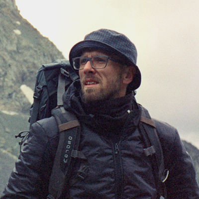

  
# Andrei Apanasik
>Took a height of 3330 meters - further more ©
## Contacts
**Location:** Minsk, Belarus  
**Phone:** +375 33 690-92-90  
**Email:** mr.interfoto@gmail.com  
**Discord:** Andrew Gertz (@A-Gertz)  
**GitHub:** A-Gertz (https://github.com/A-Gertz)

## About me
A sociologist by profession, who used the acquired knowledge in a completely new direction for himself. I have mastered digital marketing & SEO on my own and currently have over 7 years of experience in these areas. By focusing on content creation and search engine optimization, I have been able to increase ecommerce sales through a wide range of strategies, and have also proven the effectiveness of white hat promotion methods. My main strength are self-confidence and knowledge, patience, the ability to clearly express thoughts and, of course, the ability to convince. Able to work with Google services, Ahrefs, Serpstat, HTML, CSS, Bootstrap.

## Skills
* HTML
* CSS
* SEO
* Bootstrap (Basic)
* JavaScript (Basic)   

## Code Example

**Sorting random numbers**
```
bubbleSort(array)

function bubbleSort (array) {
  for (let n = 0; n < array.length; n++) {
    for (let i = 0; i < array.length - 1 - n; i++) {
	  if (array[i] > array [i + 1]) {
	    const buff = array[i]
		array[i] = array[i + 1]
		array[i + 1] = buff
	  }
	}
  }
  
  return array
}
```
## Work experience

**Sales manager, VIGURCOM Ltd distribution company**  
**2014 - 2022**
* Planning and developing digital marketing strategy
* SEO Optimisation
* Metrics & Analytics
* Creating and implementing a link building strategy

## Education

**Yanka Kupala State University of Grodno**  
**2005 - 2010**

## English

Pre-intermediate